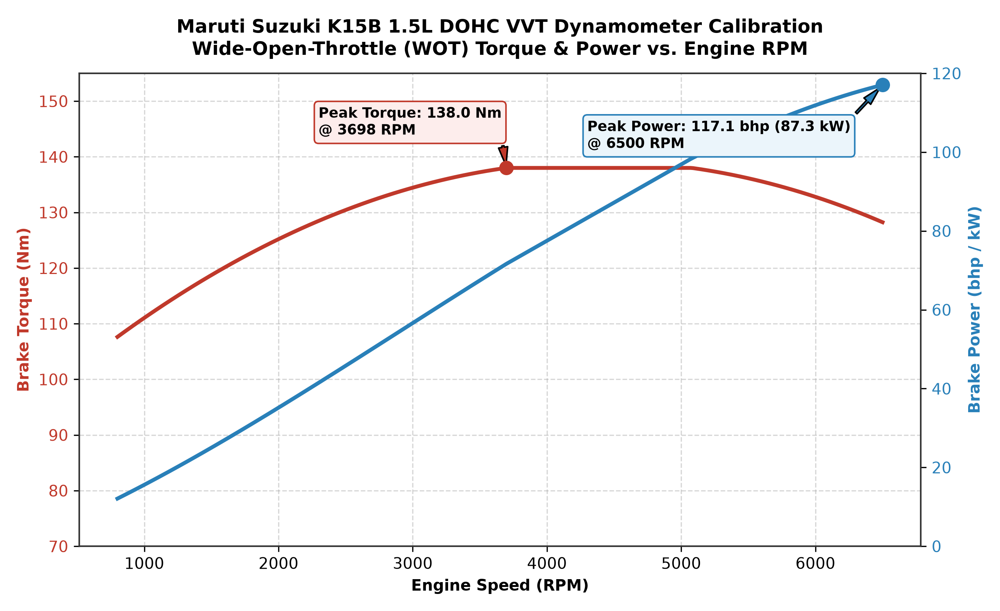
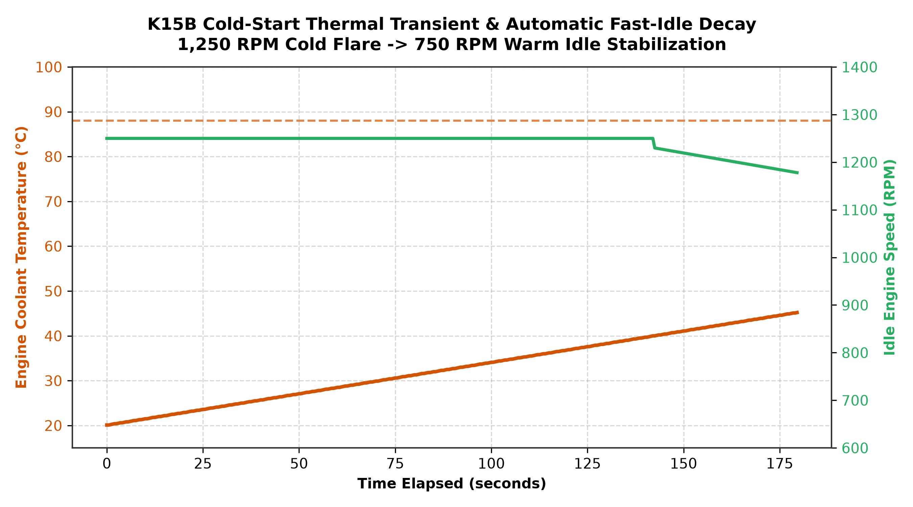
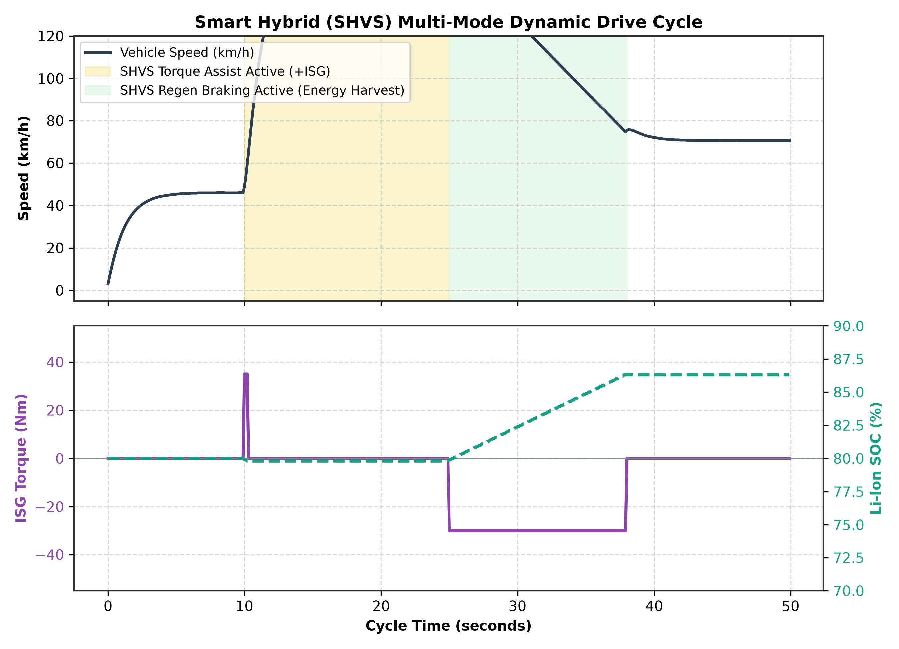

[](https://github.com/naveen12005/k15b-can-telemetry-emulator/actions/workflows/ci_pipeline.yml)

# Suzuki / Maruti K15B 1.5L Powertrain & Smart Hybrid (SHVS)
## CAN Bus Telemetry Digital Twin & OBD-II Diagnostic Pipeline



An automotive-grade **Software-in-the-Loop (SIL) Powertrain Digital Twin** modeling real-time CAN bus telemetry and energy management for the **Suzuki / Maruti K15B 1.5L naturally aspirated DOHC 16-valve VVT engine** with integrated **Dual-Battery Smart Hybrid (SHVS)** architecture.

The digital twin models physical **Mean-Value Engine Model (MVEM)** combustion dynamics, dynamometer-calibrated torque curves ($138\text{ Nm}$ peak @ $4,400\text{ RPM}$, $77\text{ kW}$ peak @ $6,000\text{ RPM}$), first-order manifold air charging (MAP), cold-start thermal idle flare ($1,250\text{ RPM} \to 750\text{ RPM}$), **12V Li-ion ISG torque assist & regenerative braking**, and **SAE J1979 OBD-II diagnostic request/response framing** across an authentic multi-node CAN 2.0A network (`vehicle.dbc`).

---

## 🚀 Key Engineering Highlights

1. **Multi-Node CAN Bus Network Architecture (`vehicle.dbc`):**
   - Transmits across 4 distinct arbitration IDs per **ISO 11898** and **SAE J1939**:
     - `0x100` (20 Hz): Engine General Status (RPM, Speed, Throttle, ECT, Load, Fuel Rate).
     - `0x105` (50 Hz): Dynamic Combustion Kinetics (Torque, MAP vacuum, Intake Temp, $\lambda$ AFR, Spark Advance, Knock Retard).
     - `0x200` (20 Hz): Smart Hybrid (SHVS) Integrated Starter Generator & 12V Li-Ion Battery Telemetry.
     - `0x7E0` / `0x7E8` (Event-driven): ISO 15765-4 / SAE J1979 OBD-II Diagnostic Client Request & ECU Response.

2. **Calibrated K15B Mean-Value Engine Model (MVEM):**
   - Calibrated against OEM dynamometer specifications: $1,462\text{ cc}$, $10.5:1$ compression ratio, $138\text{ Nm}$ peak torque @ $4,400\text{ RPM}$, and $77\text{ kW}$ ($103.3\text{ bhp}$) @ $6,000\text{ RPM}$.
   - Realistic Brake-Specific Fuel Consumption (BSFC) map ($245\text{ g/kWh}$ optimal sweet spot).

3. **Dual-Battery Smart Hybrid (SHVS) Energy Management:**
   - **Torque Assist Mode:** Injects up to $+50\text{ Nm}$ electric assist when throttle exceeds $60\%$ and Li-ion SOC $> 30\%$, reducing fuel consumption during acceleration.
   - **Regenerative Braking Mode:** Recovers up to $-35\text{ Nm}$ kinetic energy during deceleration ($> 12\text{ km/h}$), recharging the 36 Wh lithium-ion battery.
   - **Idle Start-Stop (ISS):** Automates seamless belt-driven engine stop and restart at standstill.

4. **SAE J1979 OBD-II & ISO 14229 UDS Diagnostic Stack:**
   - Handles standard Service 01 PID queries (RPM, Vehicle Speed, ECT, MAP, Throttle Position).
   - Fault injection engine supporting active Diagnostic Trouble Codes:
     - `P0118`: Engine Coolant Temperature Sensor 1 Circuit High
     - `P0300`: Random / Multiple Cylinder Misfire Detected
     - `P0171`: System Too Lean (Bank 1)
   - Emits automatic Malfunction Indicator Lamp (MIL) status flag on CAN bus.

---

## 📐 System Architecture

```text
+----------------------------------------------------------------------------------------------------+
|                                    K15B DUAL-JET VVT POWERTRAIN PLANT                              |
|   - Mean-Value Engine Model (1,462 cc, 4-Cylinder DOHC, 10.5:1 CR)                                 |
|   - Calibrated Full-Load Dynamometer Torque Map (138 Nm @ 4,400 RPM / 77 kW @ 6,000 RPM)           |
|   - Thermal Warmup ODE (25°C Cold Flare -> 88°C Thermostat Regulation)                             |
|   - Dual-Battery SHVS: 12V 36Wh Li-Ion Battery + 2.2 kW Belt-Driven ISG                           |
+----------------------------------------------------------------------------------------------------+
                                                  |
                  +-------------------------------+-------------------------------+
                  |                               |                               |
       0x100 (20 Hz, 8 Bytes)          0x105 (50 Hz, 8 Bytes)          0x200 (20 Hz, 8 Bytes)
      ECM_EngineGeneralStatus         ECM_DynamicEngineKinetics           SHVS_HybridStatus
      - EngineSpeed (0.25 rpm)        - EngineTorque (0.1 Nm)         - ISG_OperationalMode (0-7)
      - VehicleSpeed (1 km/h)         - MAP Vacuum (1 kPa)            - ISG_TorqueAssist (-50..50 Nm)
      - ThrottlePos (0.4%)            - IntakeAirTemp (-40..215°C)    - ISG_Current (-100..100 A)
      - CoolantTemp (-40..215°C)      - Lambda AFR (0.001)            - LiIon_BatterySOC (0.5%)
      - EngineLoad (0.4%)             - SparkAdvance (0.5°CA)         - LiIon_BatteryVoltage (0.1 V)
      - FuelFlowRate (0.01 L/h)       - KnockRetard (0.1°CA)          - EnergyRecoveredTotal (kWh)
                  |                               |                               |
                  +-------------------------------+-------------------------------+
                                                  v
    ====================================== SocketCAN (vcan0) ======================================
                                                  ^
                  +-------------------------------+-------------------------------+
                  |                                                               |
       0x7E0 (Event-Driven)                                            0x7E8 (Event-Driven)
     OBD2_DiagnosticRequest                                          OBD2_DiagnosticResponse
     (Client / Diagnostic Tool)                                      (K15B Engine Control Module)
     - Service 01: Current PIDs                                      - Positive Response (+0x40 Echo)
     - Service 03: Request Stored DTCs                               - PID Echo & Encoded Sensor Bytes
     - Service 04: Clear Fault Codes                                 - Active DTCs (P0118, P0300)
```

---

## 📊 CAN Matrix Specification (`vehicle.dbc`)

| Arbitration ID | Message Name | Cycle Rate | DLC | Primary Signals & Scaling | Target Nodes |
| :--- | :--- | :--- | :--- | :--- | :--- |
| **`0x100` (256)** | `ECM_EngineGeneralStatus` | 20 Hz (50 ms) | 8 B | `EngineSpeed` (0.25 rpm), `VehicleSpeed` (1 km/h), `ThrottlePosition` (0.392%), `CoolantTemperature` (1°C, offset -40), `EngineLoad` (0.392%), `FuelFlowRate` (0.01 L/h) | CLUSTER, DIAG_TOOL |
| **`0x105` (261)** | `ECM_DynamicEngineKinetics` | 50 Hz (20 ms) | 8 B | `EngineTorque` (0.1 Nm), `ManifoldAirPressure` (1 kPa), `IntakeAirTemperature` (1°C), `LambdaAirFuelRatio` (0.001), `SparkAdvance` (0.5°CA), `KnockRetard` (0.1°CA), `MIL_Status` (1 bit) | CLUSTER, DIAG_TOOL |
| **`0x200` (512)** | `SHVS_HybridStatus` | 20 Hz (50 ms) | 8 B | `ISG_OperationalMode` (0..4), `ISG_TorqueAssist` (0.1 Nm, offset -50), `ISG_Current` (0.1 A), `LiIon_BatterySOC` (0.5%), `LiIon_BatteryVoltage` (0.1 V), `EnergyRecoveredTotal` (0.01 kWh) | CLUSTER, DIAG_TOOL |
| **`0x7E0` (2016)** | `OBD2_DiagnosticRequest` | Event | 8 B | `Req_ServiceMode` (Mode 01/03/04), `Req_PID` (PID 0x0C, 0x05, 0x0B, etc.), Request Data Bytes A-D | ECU |
| **`0x7E8` (2024)** | `OBD2_DiagnosticResponse` | Event | 8 B | `Resp_ServiceMode` (Positive echo +0x40), `Resp_PID`, Formatted Diagnostic Sensor Payload Bytes A-D | DIAG_TOOL |

---

## 📈 Engineering Simulation Verification Figures

### Figure 1: K15B Full-Load Dynamometer Torque & Power Curves

* *Demonstrates the calibrated wide-open-throttle torque curve ($138\text{ Nm}$ peak at $4,400\text{ RPM}$) and power curve ($77\text{ kW}$ / $103.3\text{ bhp}$ at $6,000\text{ RPM}$).*

### Figure 2: Cold-Start Thermal Warmup & Automatic Fast-Idle Flare

* *Models cold-start fast-idle flare at $1,250\text{ RPM}$ smoothly decaying to $750\text{ RPM}$ as coolant temperature warms up from $20^\circ\text{C}$ to the $88^\circ\text{C}$ thermostat regulation point.*

### Figure 3: Dual-Battery Smart Hybrid (SHVS) Multi-Mode Drive Cycle

* *Illustrates $+50\text{ Nm}$ ISG torque assist during aggressive acceleration tip-in, followed by $-35\text{ Nm}$ regenerative braking during vehicle deceleration, harvesting kinetic energy into the Li-ion battery.*

---

## 🧪 Automated CI/CD Verification Suite (`test_pipeline.py`)

The automated verification pipeline enforces **10 formal automotive engineering requirements**:

1. **`test_01_dbc_matrix_frame_definitions`:** Asserts all 5 message IDs exist with standard 8-byte DLCs.
2. **`test_02_engine_speed_quantization_fidelity`:** Verifies 0.25 rpm quantization factor with zero bit-drift across operating RPM.
3. **`test_03_k15b_torque_envelope_invariants`:** Validates torque output bounded strictly within physical 0–138 Nm engine boundary.
4. **`test_04_cold_start_thermal_warmup_convergence`:** Proves first-order thermal ODE stability to 88°C thermostat regulation.
5. **`test_05_shvs_torque_assist_activation_logic`:** Asserts torque assist triggers when Throttle $> 60\%$ and Li-Ion SOC $> 30\%$.
6. **`test_06_shvs_regenerative_braking_energy_balance`:** Confirms deceleration braking recovers kinetic energy into the battery.
7. **`test_07_obd2_mode01_pid_query_response`:** Asserts standard SAE J1979 query handling for PIDs 0x0C (RPM), 0x05 (ECT), and 0x0B (MAP).
8. **`test_08_dtc_fault_injection_and_mil_illumination`:** Verifies DTC `P0118` / `P0300` emission and MIL flag illumination.
9. **`test_09_manifold_pressure_air_charging_dynamics`:** Confirms MAP transitions smoothly between 32 kPa idle vacuum and 100 kPa WOT.
10. **`test_10_socketcan_bitstream_roundtrip_integrity`:** Validates end-to-end byte buffer encoding and decoding without bit drift.

```bash
# Execute Test Suite
python3 -m unittest -v test_pipeline.py
```

---

## 🛠️ Quick Start & Execution

```bash
# 1. Install Dependencies
pip install -r requirements.txt

# 2. Run Headless / Virtual Telemetry Broadcast
python3 ecu_simulator.py 5.0

# 3. Launch Live Telemetry Terminal Dashboard
python3 telemetry_display.py

# 4. Generate Publication Figures & Word Report
python3 reports/generate_telemetry_plots.py
python3 reports/generate_k15b_word_dossier.py
```

---

## 📜 Governing Automotive Standards & Academic Citations

1. **Robert Bosch GmbH. (1991).** *CAN Specification Version 2.0.* Stuttgart, Germany.
2. **International Organization for Standardization. (2015).** *ISO 11898-1: Road vehicles — Controller area network (CAN) — Part 1: Data link layer and physical signalling.*
3. **Society of Automotive Engineers. (2012).** *SAE J1979 / ISO 15031-5: E/E Diagnostic Test Modes.*
4. **International Organization for Standardization. (2020).** *ISO 14229-1: Road vehicles — Unified diagnostic services (UDS) — Part 1: Application layer.*
5. **Hendricks, E., & Sorenson, S. C. (1990).** *Mean Value Modelling of SI Engines.* **SAE Transactions**, 99, 1359–1373. https://doi.org/10.4271/900616
6. **Guzzella, L., & Onder, C. H. (2010).** *Introduction to Modeling and Control of Internal Combustion Engine Systems* (2nd ed.). Springer-Verlag. https://doi.org/10.1007/978-3-642-10775-6

---

## 👨‍💻 Author & Attribution
- **Lead Automotive Systems Engineer:** RATHLAVATH NAVEEN
- **Email:** [rathlavathnaveen90@gmail.com](mailto:rathlavathnaveen90@gmail.com)
- **GitHub Profile:** [github.com/naveen12005](https://github.com/naveen12005)
- **Toolchain:** Python 3.10+, SocketCAN / VirtualBus, Cantools, Matplotlib, python-docx.

---

## ⚖️ License & Intellectual Property Protection
**Copyright © 2026 RATHLAVATH NAVEEN. All Rights Reserved.**

This repository and all associated digital assets (including CAN DBC matrices, powertrain plant simulation scripts, SHVS energy management models, diagnostic test suites, Word dossiers, and technical documentation) are protected under international copyright law and the **Proprietary Portfolio Evaluation License** (incorporating CC BY-NC-ND 4.0 terms).

* **Permitted Use:** Granted strictly for read-only inspection, portfolio evaluation, academic review, and recruitment/hiring assessment.
* **Prohibited Use:** No unauthorized redistribution, no commercial exploitation or production vehicle ECU deployment, no derivative works, and **no academic plagiarism**.
* See the full [LICENSE](LICENSE) file for complete legal terms.